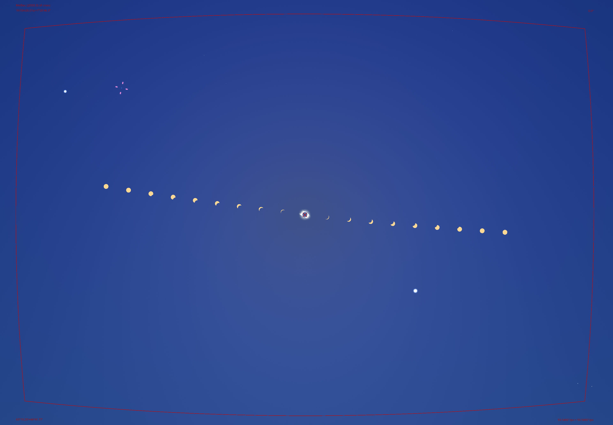

Add tags and stuff (equipment, astro, etc.)

Ever since I first heard about the eclipse back in August of last year, I knew I wanted to try to make it to the path of totality on April 8th. I also knew that, being someone interested in photography, I would probably want to photograph it somehow. What I didn't know about was the 6+ months and hundreds of hours I would spend learning about and practicing astrophotography, embedded programming, hardware prototyping, 3D design/integration, and software application development.

So, even though I'm still in the midst of this process (currently T-32 days to the eclipse!), I wanted to try to share my journey in case it inspires anyone else to take on a similar journey of learning.

The [other posts in this series](/series/2024-tse) will go into the details of how exactly this all came about, but in this post I'll outline my (current) general plan for the eclipse.

## Equipment

Add links to equipment pages when I make themAdd link to stereo stuffBefore I learned about the eclipse, I already had a Canon EOS Rebel T6 (entry-level DSLR) and a sturdy old Velbon VS-3 tripod, both of which I got for cheap on Facebook marketplace years ago. I also had a Canon 55-250mm telephoto lens that, up to that point, I had mainly used for photographing wildlife and high-resolution panoramas.

So, as I started researching how to photograph the eclipse, I realized that I could use the gear I already had and make a solar filter to capture the partial phases. However, I wasn't looking forward to the prospect of having to adjust the camera every couple of minutes to keep the sun in frame. I did track the moon by hand during the [January 21, 2019 total lunar eclipse](https://www.youtube.com/watch?v=jNAeuM-qnIA), but it was pretty tedious. Huh, I guess I've been doing astrophotography for longer than I realized...

In order to automate the process of pointing a camera at the sun, a tracking mount can be used to counter the rotation of the earth. This same type of mount can also be used to improve long-exposure photos of the night sky by eliminating (or at least reducing) star trailing in the images.Star trailing is when the stars in an image appear to streak across the sky as a result of Earth's rotation (see [the 500 rule](https://astrobackyard.com/the-500-rule/)).

So, when I saw a [Star Adventurer Mini](https://www.skywatcherusa.com/products/star-adventurer-mini) star-tracking mount on eBay for $200, I took the plunge and bought it with the intention of using it for both the total solar eclipse and astrophotography. After I got hooked on astrophotography, I also bought a Canon EOS M200 camera (on eBay as well) for its more efficient sensor, ability to be controlled via WiFi API, articulating display, and 4K video capabilities.

I also have a couple GoPro Hero5's that I use to shoot stereo videos.Can you guess where I got them? Anyways, more info on that soon!

By the start of this year, I had<$1000 total cost (secondhand):
- **Cameras:** Canon T6, Canon M200
- **Lenses:** 18-55mm kit lens, 55-250mm telephoto
- **Action cams:** 2 x GoPro Hero5 Black
- **Star tracker:** Sky-Watcher Star Adventurer Mini
- **Solar filters:** 2 x 6"x6" Thousand Oaks solar filter sheets

Cut out most of this when I make other posts that explain this?Add linksBut remember, I wanted to *enjoy* the eclipse, and so I started to think about just how automated I could make my setup. I had already experimented with using an ESP8266 as a WiFi intervalometer for my Canon M200, but I had the idea for something much more ambitious: a generalized application that would allow me to construct arbitrarily complex sequences of actions including taking pictures, changing camera settings, starting/stopping video recordings, taking sensor readings, and possibly even controlling servo motors to automatically remove solar filters from the cameras during totality.

In order to support these capabilities, I also put in an order on AliExpress for<$25 total cost:
- **Microcontroller boards:** 2 x ESP32 DOIT DevKit v1 clones
- **Accessories:**
    - 2 x BME280 temperature/pressure/humidity sensors
    - 2 x NEO-6MV2 GPS modules
    - 2 x MicroSD modules
    - 4 x SG90 servo motors
    - 10 x 30cm servo extension cables

In addition to the gear I already have, I recently realized that my college's library offers lots of technology that's free to check out. I might end up checking out a couple tripods or even another GoPro if they're available before I leave for Dallas.The loan periods for these items is 3 days, which should be long enough. I would plan on checking out power banks too, but they're only available for 24 hour loans.

## Location

Speaking of Dallas, that's where I plan on being the day of the eclipse.The duration of totality in Dallas, TX will be about 3 minutes and 30-45 seconds, depending on where in the city you are. Since I won't have access to a car for transportation, I just have to hope that Dallas has clear skies (about 50% chance) and that I can get to a suitable viewing location using public transportation and my own two feet. Right now I'm planning on going to Trammel Crow Park, which should be wide open enough not to be overcrowded (hopefully).

## Eclipse close-up at 250mm

For my close-up of the eclipse during the partial and total phases, I plan to use the Canon M200 on my star tracking mount and with the 55-250mm telephoto. The shots I want to try to get are as follows:
1. Time-lapse of partial phases (1 frame every 10ish seconds)
2. HDR composite of totality
3. Diamond ring photo
4. Baily's beads sequence

The last two are stretch goals, but with enough automation, all of it *should* be possible. I will be using an ESP32 board to trigger exposures and change settings over WiFi (using the [Canon CCAPI](/tags/ccapi)).

### Partial phase time-lapse

For the time-lapse, we can simply trigger the shutter every 10 seconds. The exposure should be manual; if it is set to shutter or aperture priority, it will try to keep the frame well-exposed, meaning that as the amount of light from the sun decreases, the exposure will increase. Spot metering won't help much either, because the portion of the sun that isn't covered is changing.

However, if the exposure is set to manual, we should also be doing exposure bracketing up to maybe EV +2 or +3 in case there are clouds that make the sun dimmer but still visible. **But my camera doesn't have built-in exposure bracketing.** So, maybe we can manually take 2-3 shots every ten seconds? While changing the settings every time via the WiFi API?

### HDR composite of totality

Once again, **my camera doesn't have built-in exposure bracketing**. When being controlled over WiFi, it can only take a photo about once every secondit's much faster when pressing the shutter by hand, but for some reason you have to wait for it to fully save each photo when using the WiFi API, but that should still be fast enough to allow it to gather ample data for a nice composite of totality.

My current plan is just to run as many exposure stacks as I can during the eclipse, ranging from extremely short exposures which capture the inner portions of the sun's atmosphere, to medium exposure lengths which capture detail in the corona, to longer exposures (5+ seconds) in hopes of capturing [Earthshine](https://en.wikipedia.org/wiki/Earthlight_%28astronomy%29).

Assuming each stack takes 10-20 seconds, that gives us enough time for about 10-20 total HDR stacks of totality, which can be composited in any number of ways to produce different views of the eclipse.

### Diamond ring photo

Since I'm using an ESP32 board to control the setup, I plan on using a GPS module as an accurate source of time. I'm also planning on using a servo motor to automatically remove the solar filter for totality and replace it afterwards. So theoretically, I can set it to remove the filter 5-10 seconds before totality and snap a photo or two before the sun is fully covered. However, it might be a bit harder if I also want to capture Baily's beads, as I'll discuss in the next section.

### Baily's beads

[Baily's beads](https://en.wikipedia.org/wiki/Baily%27s_beads) only occur for a few seconds at the beginning and end of a total solar eclipse. Because they're caused by the topography of the very edge of the moon as it meets the disk of the sun, they vary both between different eclipses and depending on your location within a single eclipse.

Since Baily's beads are a very short and dynamic phenomenon, people often try to photograph it using continuous shooting at a high framerate (10+ fps). While I can shoot at 6-7 fps in continuous drive mode using my camera's API (at least until the buffer fills up after a few seconds), I want to try to capture a video of this moment instead. To capture detail in Baily's beads, the exposure will have to be about 1/1000 sec or less, in contrast to the 1/60 sec or so needed for the diamond ring effect.

### Automation

It's possible to achieve a subset of my goals using an intervalometer app, good timing, practice, and some luck. But, some automation is needed to pull off everything I listed above, at least with my equipment (re: no exposure bracketing, no built in intervalometer, no manual exposure presets, etc.).

I could write a program, specifically tailored to the eclipse, which manually encodes the sequence of actions I want to be executed such as photos, settings changes, switching modes, and so on. I would have to carefully handle the state of the program in the case of errors, restarting in the middle of the eclipse, or other unexpected behavior. Even so, this would probably take a fraction of the effort of what I ended up deciding on:

I'm building a generalized web application called [Sequent](https://github.com/evoth/sequent)Update this link to something more relevant that allows for the recursive construction of arbitrarily complex sequences of actions, each of which may have any number of adjustable parameters which are themselves recursive in nature. It offers a timeline view (like a video or audio editor) to rearrange components of the sequence, but instead of video or audio tracks, they represent the timing of actions or other sequences within the sequence.

Alongside the app, I'll write a "backend" program to run on the ESP32 which simply parses the output of the web app and executes the actions accordingly. Because the web app will ensure consistency of the sequence, all the backend program will need to do is correctly manage the state of the camera to comply with the instructions found in the exported sequence file. This way, the program should be resilient to restarts or other issues, assuming the backend program is written correctly.

Then, if I want to adjust the sequence or even redo it entirely, I can just make those changes in the web app instead of having to redo the ESP32 program while trying to forsee any new edge cases. I can also use this program in the future for astrophotography, time-lapses, or anything else that could benefit from automating complex sequences of actions.

While this probably sounds overambitious (it almost certainly is), at the time of writing I've made good progress and there's no reason I shouldn't be able to complete it (fingers crossed!). If I do complete it, programming in the above shots should be fairly trivial. If not, I'll scramble to write a custom program to do it like I probably should have done in the first place.

**Update 2024-03-19:**

I just now realized that when originally writing this, I left out a crucial piece of the puzzle: the reason I didn't want to use existing eclipse automation software on a Mac or PC. This was the first option I considered, but I ended up settling on my current plan due to the following reasons:
1. I simply don't own a computer that I can trust to run reliably for the full duration of the eclipse. My laptop can probably last 3 hours on battery, but I likely won't have access to an outlet for the entire day, and it's way too close to risk it.
2. Even if I knew it would last, I don't want to be burdened by babysitting a laptop (with physical connections to multiple cameras) for 3 hours. I have no idea how crowded my location will be or what the weather conditions will be, but I can't imagine a scenario in which a laptop doesn't add extra stress to the situation.
3. I was already intrigued by the customization (of both hardware and software) that the microcontroller approach would allow, and I was further enticed by the challenge that it would bring.

So far, I'm glad I went with this option simply because of the number of new things I've learned and the skills I've gained!

## Sun and planets at 18mm

Here's a depiction of the image I hope to capture at 18mmkeep in mind that I'm using a crop sensor camera, which is why 18mm is still relatively tight:

This image was made using [Stellarium](https://stellarium.org/) and Photoshop, simulating an exposure every 10 minutes for 1.5 hours on either side of totality. The bright dot down and to the right of center is Venus, and similarly Jupiter is in the top left. Both of these should be visible during totality, and Venus may even be visible for some minutes before and afterwards. I could also catch Saturn and/or Mars in the bottom right corner if I frame it right.

A big reason that I want to capture this view is because of the unique chance to capture a comet, [12P/Pons-Brooks](https://en.wikipedia.org/wiki/12P/Pons%E2%80%93Brooks) (purple crosshairs next to Jupiter in the image), which will be making its perihelion passage around the sun in the weeks following the eclipse. It's uncertain whether it will be bright enough to see during totality, but if it is, it would be a once-in-a-lifetime opportunity to capture both events in a single image!

For this image I'll be using an 18-55mm kit lens with my Canon T6, which doesn't have an officially documented control API. However, with some [PTP/IP trickery](https://julianschroden.com/post/2023-05-10-pairing-and-initializing-a-ptp-ip-connection-with-a-canon-eos-camera) I should be able to control it with a second ESP32 board. Assuming I get that working (which I've already done in Python, but not C++), I can execute a similar sequence of shots to my 250mm plan above. For this camera, I'll focus more on long-exposure images during totality, and I'll try to prioritize the diamond ring images over Baily's beads because of how wide the frame is.

## GoPro composite

Since I have two identical GoPro Hero5 Black cameras, I had an idea: mount them side-by-side (I already have a mount for this from some stereo videography experiments), and put a solar filter over one of them. Then, I can shoot a photo time-lapse with both of them, using manual exposure for the one with the solar filter. This setup makes the following products possible:

- Full time-lapse of the eclipse (surroundings, changing light, weather conditions, etc.)
- Full time-lapse of the sun during the partial phases
- Combination time-lapse with superimposed sun?
- **Wide angle composite** similar to the 18mm view, but with a wide enough angle to include foreground elements

The nice thing about this shot is that it should be set-and-forget, since it's just using the GoPro photo time-lapse feature. And, it would allow me to remember my experience in the context of the environment.

## Video(s) during totality

I haven't planned this part out yet, but I would like to have some real-time video of totality. As I mentioned further above in the post, I could check out yet another GoPro from my college's library, which could then be controlled via WiFi. Or, I could just use my phone. Or, I could do both. *Or*, I could go totally over the top and build a 2-axis servo mount which could be used to point a camera in a preprogrammed series of directions, capturing phenomena like shadow bands, 360 degree sunset, crescent shadows, etc.

No matter what I end up doing, hopefully it eliminates the feeling that I'm missing out by not capturing something. It's a once-in-a-lifetime experience, so I should enjoy it to the fullest extent possible. Even if everything fails, it's the moment and the memory that are the real reasons I wanted to see the eclipse in the first place.

## Why?

Because. Because I love learning new things, because I love challenging myself, because if there's even a small chance that this all works out, it's worth giving it a shot. Because I want to enjoy the eclipse without worrying about capturing it, so instead I'm spending months doing the worrying ahead of time. Because it's a way for me to prove to myself that I can do things that I wouldn't have previously imagined I could do.

Even if it ends up being cloudy on the day of the eclipse or something else goes wrong, the knowledge and confidence that I've gained along the way will have been more than worth it. Success would just be the icing on the cake!

In the next posts in this series, I'll be going into more detail on the different parts of this journey. If I have enough time to write them, that is...