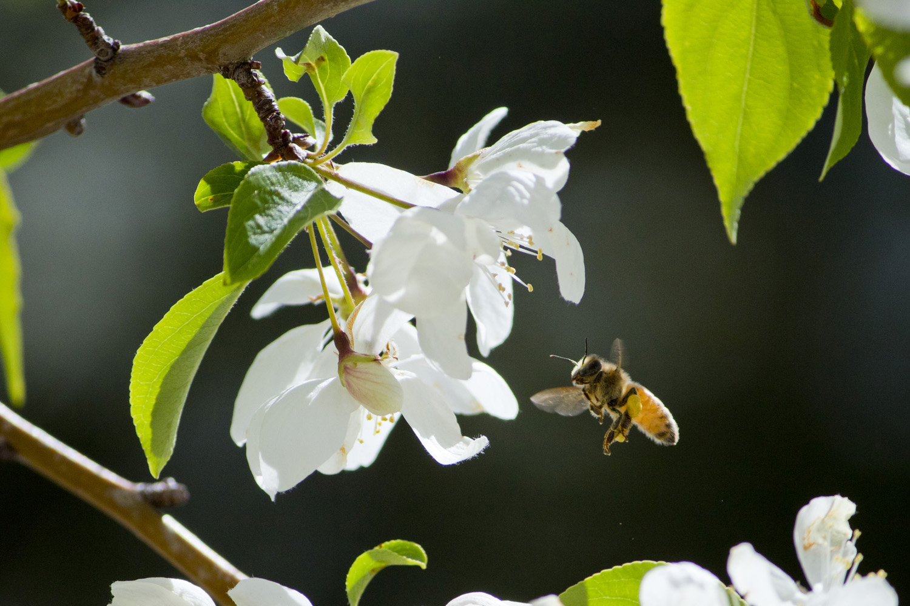
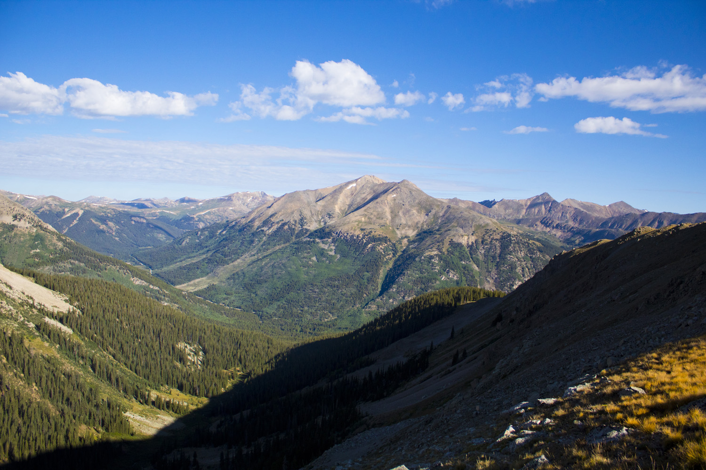
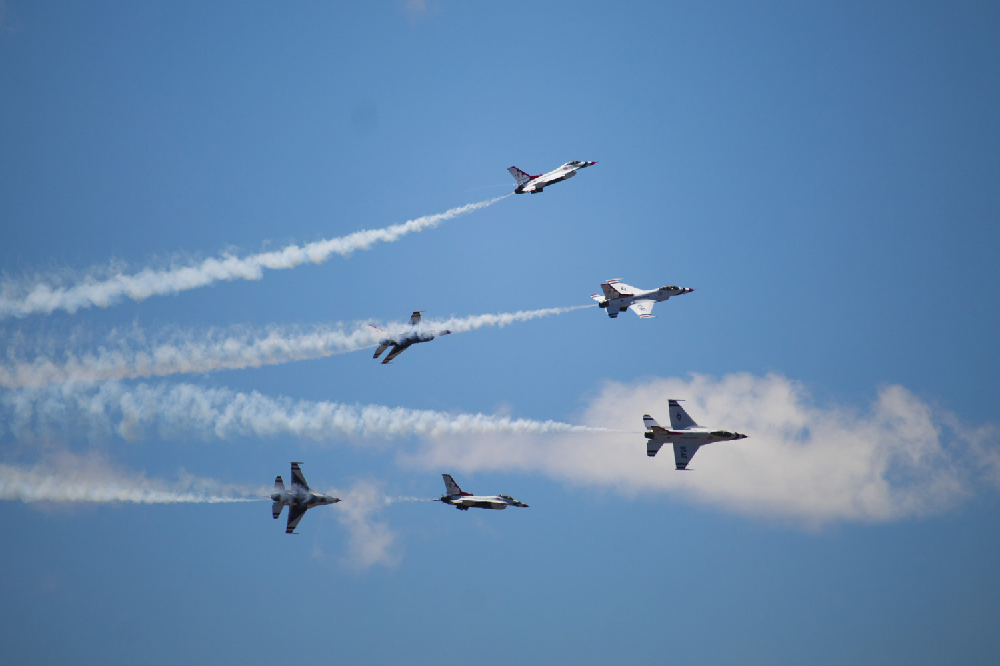
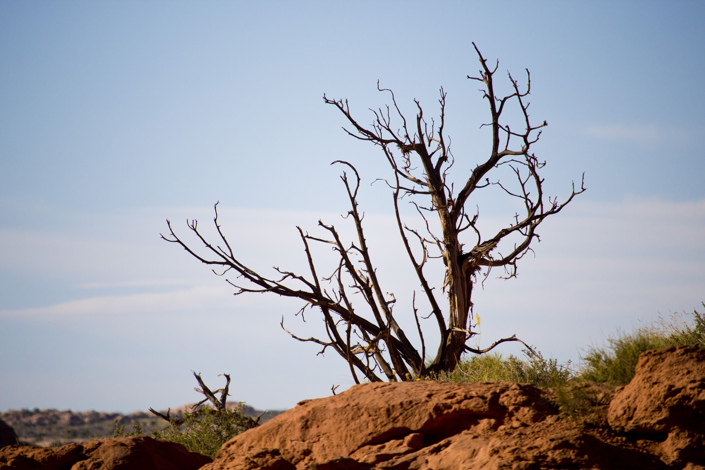
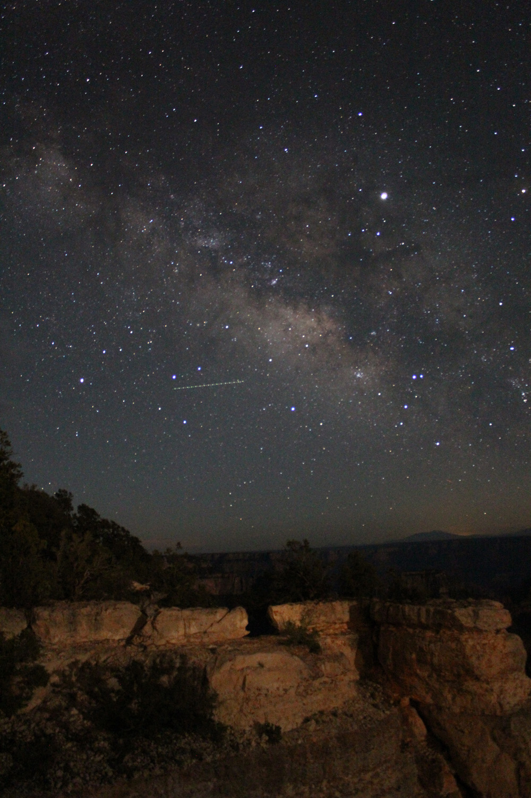
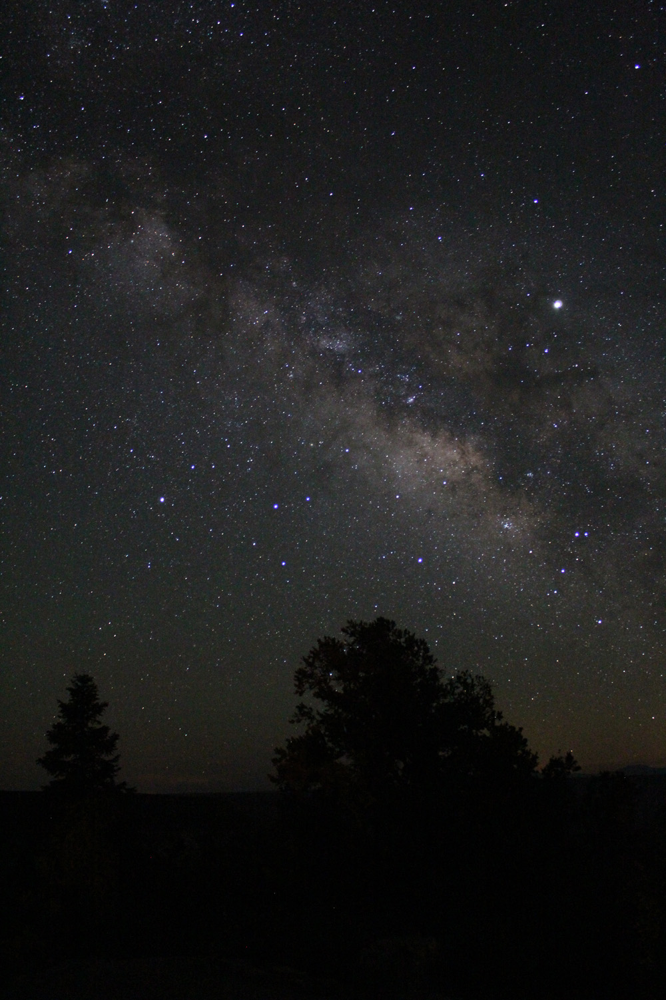
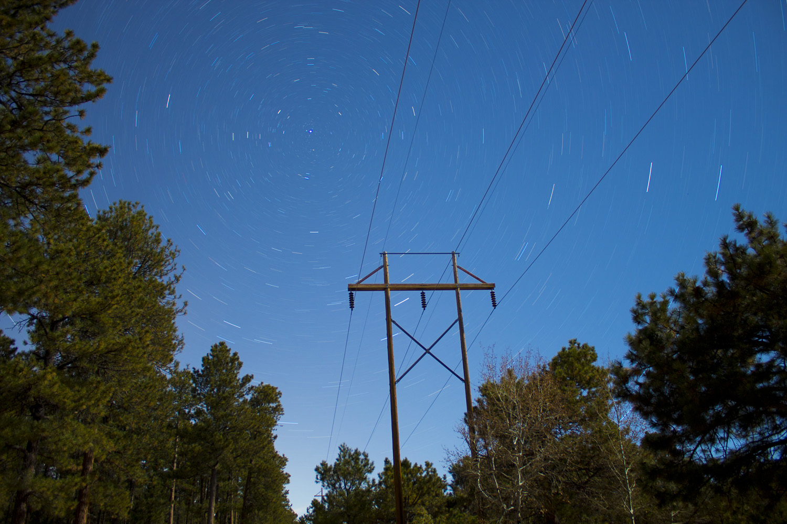
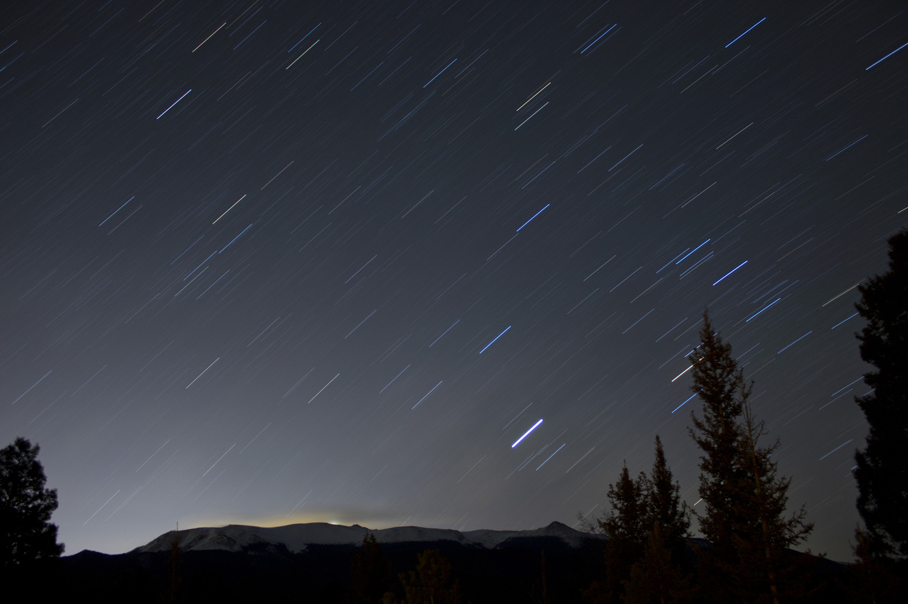
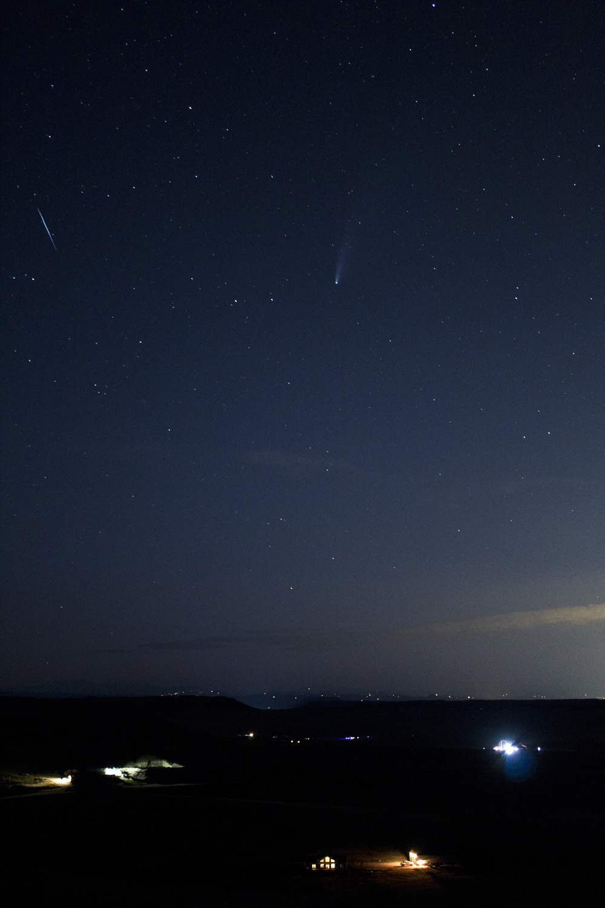
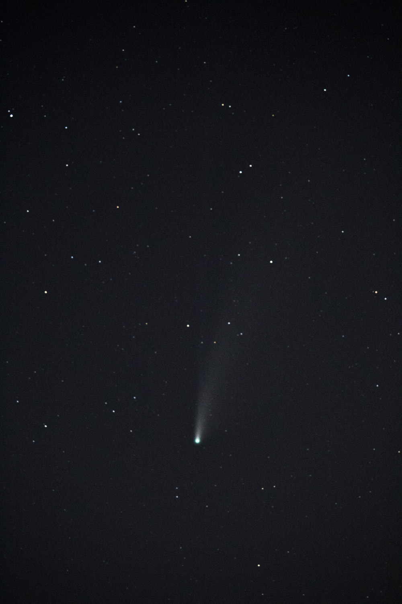

As I mentioned in the [previous post](/posts/2024-03-04_2024-tse-plan), when I first learned of the April 8th solar eclipse back in August, I started planning how I was going to make it to the path of totality. I also couldn't help but start planning how I was going to photograph it. I began ravenously consuming YouTube videos about the subject, researching solar filters, looking at videos from the 2017 eclipse for inspiration, and so on.

But, before I get into the rest of the post, I should talk about the photography experience I already had prior to that moment (or you can [click here to skip ahead](#star-tracker)).

## Photography background

I've had my Canon T6 (with a 18-55mm kit lens and 250mm telephoto lens) for almost 5 years now, which I've used to take pictures of landscapes, wildlife, and anything else that's better suited to a DSLR than to a smartphone camera.


  
  
  
  
  
  


And, while I hadn't known much about astrophotography, I did at least have some experience taking long exposure pictures of the stars. Some of the darkest skies I've seen were on the North Rim of the Grand Canyon, where I took these photos in June 2019:


  
  
  
  


I had also played around with star trails, which I took using bulb mode on the camera app:

And, apparently I had even taken a shot at capturing [Comet NEOWISE](https://en.wikipedia.org/wiki/Comet_NEOWISE) on July 21, 2020 (which I had forgotten about until now):


  
  
  
  


So, it's safe to say I had prior experience shooting the night sky, at least more than I realized. But as you can see, I hadn't photographed any "deep sky" objects, which is now my favorite kind of astrophotography. Anyways, let's go back to when I first learned about the eclipse.

## Star tracker