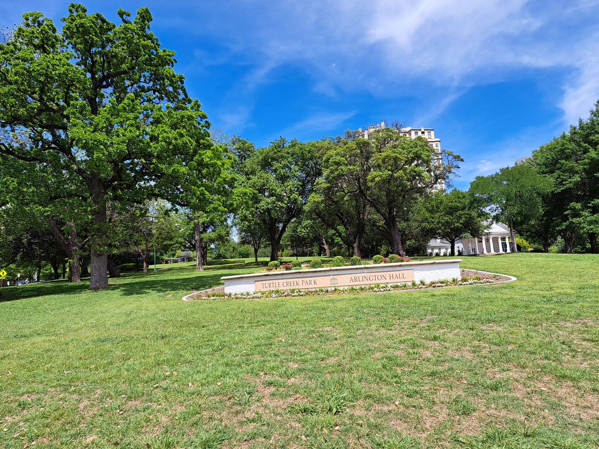
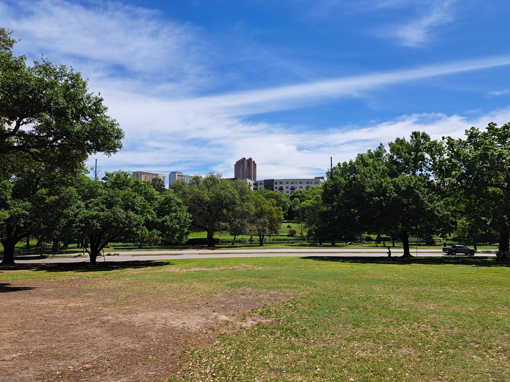
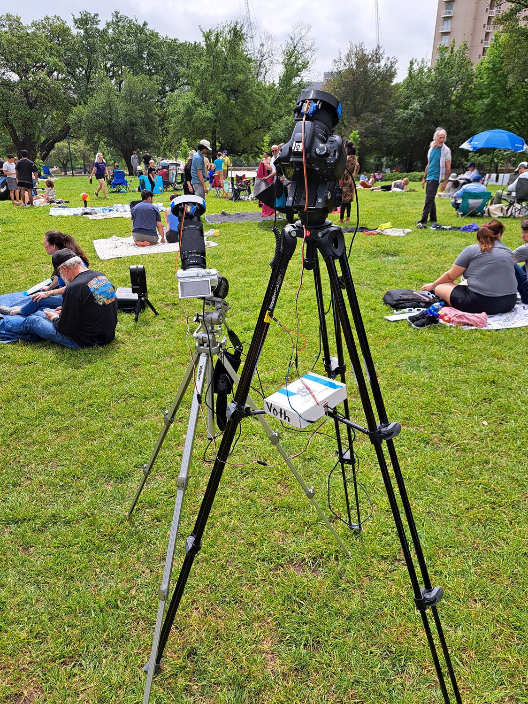
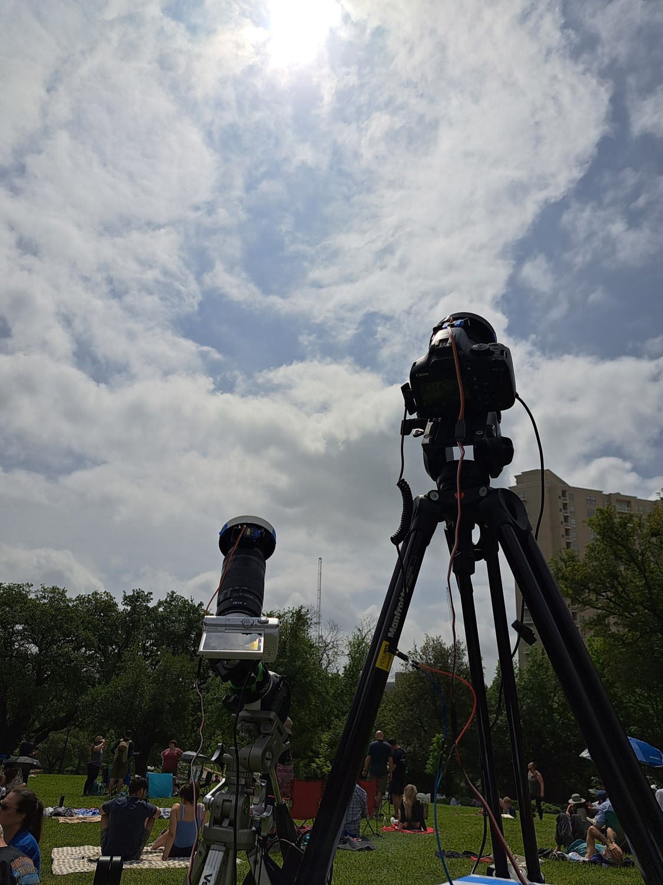
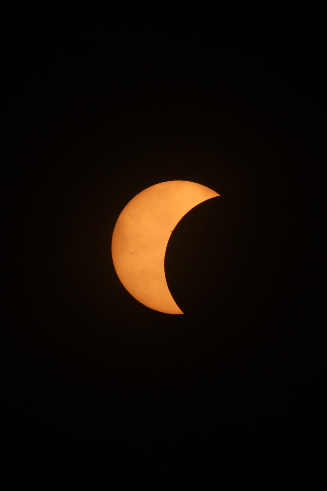
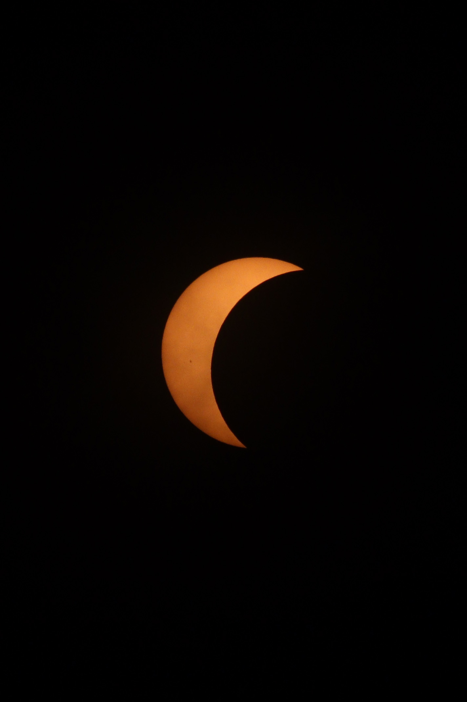
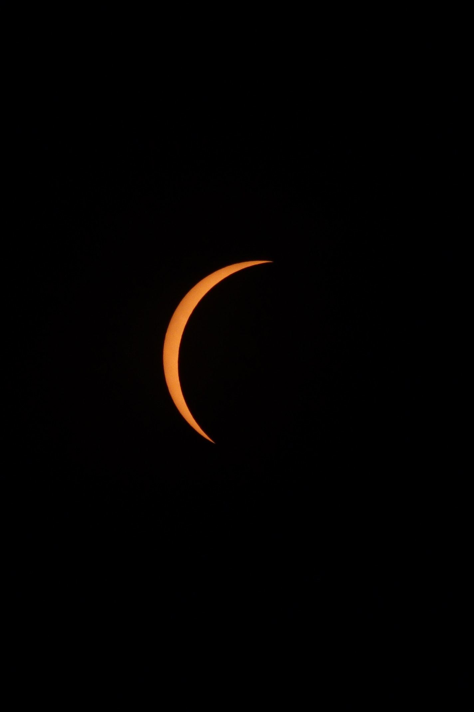
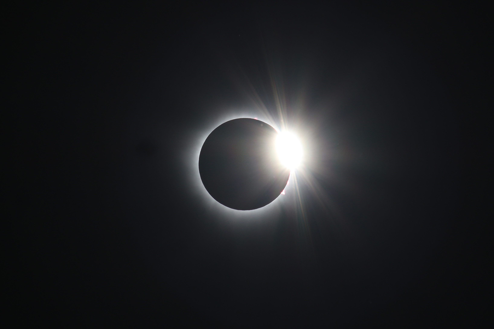

As it turns out, I didn't in fact have time yet to write the additional posts I promised at the beginning of the [previous post](/posts/2024-03-04_2024-tse-plan). In fact, I've been sorely lacking for time the past few days as a result of numerous last-minute adjustments that were informed by full practice runs. I guess that's what I get for cutting my preparation so close, but to be fair, my system only assumed a semblance of full functionality over the past week or so. Before then, I've been spending as much time as possible developing the various parts of the system since I started development on January 31st.

But I'm getting ahead of myself. As I write this, it's 9:04 pm CDT on April 8th, and I'm at 30,000 feet on my return flight from Dallas. In this post, I want to reflect on yesterday and today (eclipse day!), and then I'll work backwards from there in subsequent posts.I'm planning to write posts on the aforementioned last-minute issues, my final setup and results, and then in later posts I'll cover the more extended backstory of this journey.

## Eclipse Eve

Me and my family arrived in Dallas on the morning of April 7th (yesterday). Thankfully, we were able to get a good deal on a hotel room months ago, and we were able to check in early to drop off our extra belongings. After spending the day scouting out prospective viewing locations and enjoying the cityunder tantalizingly clear skies, I might add!, we returned to the hotel room for the night.


  
  
  
  


I spent a few hours working out the last few kinks in my system and solidifying the eclipse sequence with contact times for our chosen viewing spot (Turtle Creek Park). Then, I checked the weather (which had become a bit of an unhealthy habit at this point) before heading to bed.

## Eclipse Day

At 7am on eclipse day, we woke up to nothing but a thin veil of cirrus in the sky and an improved cloud cover forecast for the eclipse. However, it was hard to remain hopeful as low clouds began to roll in around 9am. By 10, it was mostly overcast, but it was time to leave the hotel regardless.

We made the modest trek from our hotel to Turtle Creek Park, where I began to set up my gear.We didn't have a car, so we figured the easiest place would be somewhere within walking distance. As a result of my rehearsals, this was almost second nature, and the excitement began to build when we began seeing patches of clear sky from time to time. Then, I turned on my equipment, hit the start button on my sequence (which will be detailed in future posts), and suddenly there was nothing to do but wait and enjoy the moment. After all, the entire reason I built such an over-the-top automation system was so that I could sit back and relax on eclipse day.


  
  
  
  


The first contact came and went, and to our delight, the skies began to clear and the sun was mostly visible with only a few stray clouds periodically blocking our view. The partial phase wore on, with the sun becoming an ever thinner crescent and the temperature dropping noticeably. My cameras clicked away, and as the crowd grew so did the collective anticipation. Would the sky clear up? Would a stray cloud block our view?

Either way, it was finally about to happen. I had a great time talking to people: some were interested in my setup, a couple were alumni from my college (who got engaged right after totality!!), and I even got some phone numbers from people who want copies of my photos!


  
  
  
  
  


The clouds continued to thin, but not totally disappear. The lighting became noticeably darker, shadows began to look strange, and the sun was reduced to an impossibly thin scythe of fire. The clouds finally dispersed, as if to clear the stage for this great cosmic spectacle. Then, *totality*. The minutes during and surrounding totality were a blur, and I still get chills remembering it. I won't go into detail about my personal experience, as I'm sure other people's words have done it more justice than I could. But as for my system, everything worked perfectly.

At 25 seconds before C2, the motorized solar filters opened, and both cameras took some diamond ring photos. Then, they went on to capture Baily's Beads and perform extreme exposure bracketing during totality. As I gazed up at the hole in the sky and my surroundings, I forgot about the cameras entirely and was able to soak in the moment with my family.

After 3 minutes and 47 seconds in the umbra of the moon, the sun returned with a brilliant flash, and I observed shadow bands along with the swift returning of the light. I felt a sense of joy and gratitude, and the adrenaline from witnessing such an awe-inspiring event had me shaking for many minutes afterwards.


  
  
  


After totality, the crowd thinned rapidly, but I hung around to capture the second partial phase under beautiful clear blue skies. It felt almost like waking up from a dream, except it had been more amazing than anything I could imagine in a dream. Finally, I watched the last speck of the moon flee the sun, packed up my gear, and headed back home.