Check back soon for more detailed insight on this project's inspiration, process, and lessons! For now, here's information from the [GitHub repo](https://github.com/evoth/esp-intervalometer):

## Features

- Simple design for easy operation on mobile devices, made with Svelte
- Dark and light modes for use in both nighttime and harsh daylight
- Ability to specify ESP8266 and camera IP addresses (not hard-coded)
- Realtime status updates across multiple devices using WebSockets
- Support for custom bulb exposures of any length
- Detailed error messages for easy diagnosis of issues

## Screenshots


[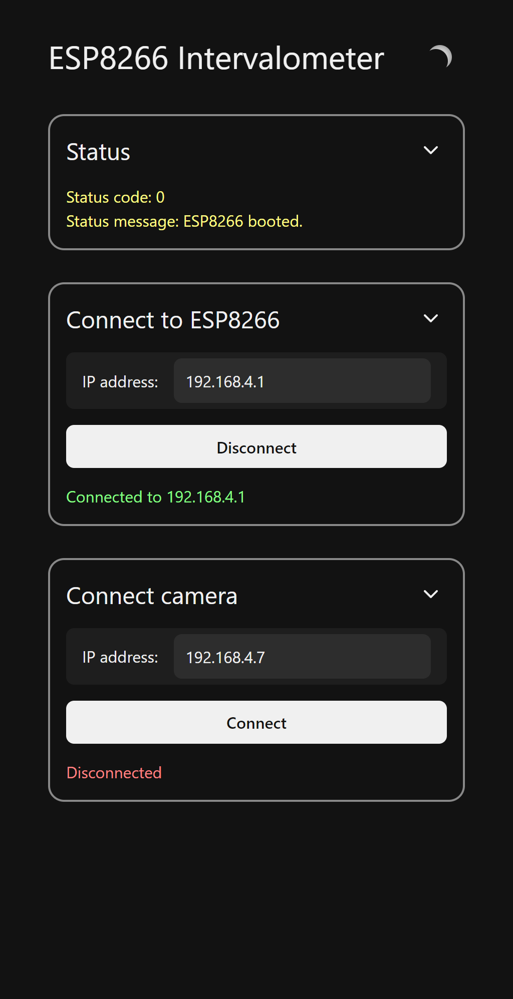](screenshots/screenshot_1.png)
[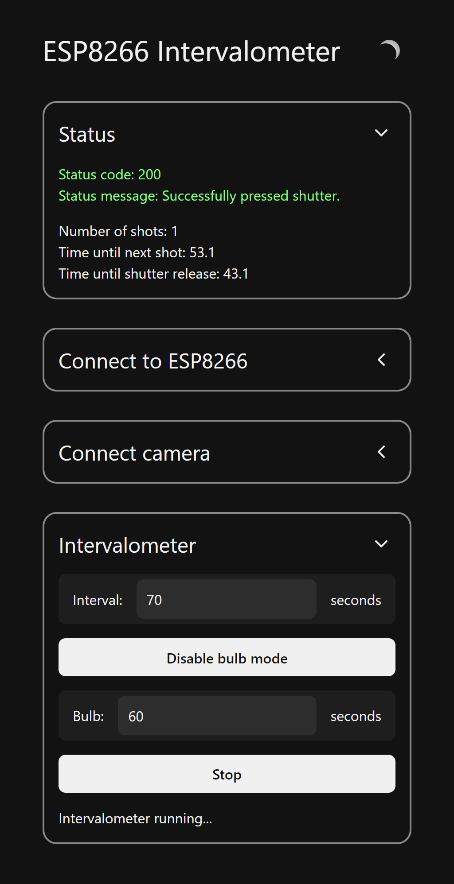](screenshots/screenshot_2.png)
[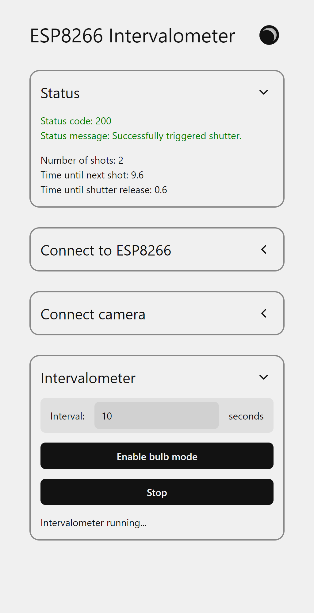](screenshots/screenshot_3.png)
[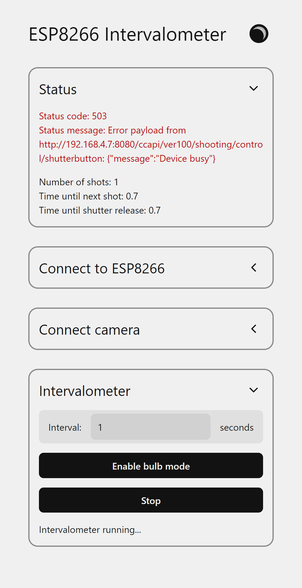](screenshots/screenshot_4.png)


## Installation

This project uses Canon's Camera Control API (CCAPI), which enables Wi-Fi control of the camera. However, only certain cameras are supported and the CCAPI needs to be "activated" on a per-camera basis. It would be nice if cameras included CCAPI functionality by default, but unfortunately we have to jump through some hoops just to enable it.

### Canon camera compatibility

Supported cameras as of 2024-01-15: PowerShot V10, EOS R100, EOS R8, EOS R50, EOS R6 Mark II, EOS R7, EOS R10, EOS R3, EOS M50 Mark II, EOS R5, EOS R6, EOS 850D, EOS-1D X Mark III, EOS M200, EOS 90D, EOS M6 Mark II, PowerShot G5 X Mark II, PowerShot G7 X Mark III, EOS 250D, EOS RP, PowerShot SX70 HS

See [this article](https://developers.canon-europe.com/s/article/Latest-CCAPI) for more details. Some cameras require firmware updates to use all features.

### CCAPI activation

_(Based on [this article](https://developercommunity.usa.canon.com/s/article/How-do-I-apply-for-a-development-tool-SDK-API-Etc))_

1. Register for an account on the [Canon Developer Community](https://developercommunity.usa.canon.com/s/) website.
2. Click on the `SDK | API | DOWNLOADS` button at the top left.
3. Click `EOS & POWERSHOT CAMERAS`.
4. Navigate to the `CCAPI ACTIVATION TOOL` tab. It may be hidden beneath the `MORE` tab on the right.
5. Fill out the access request form. Below you can see my answers for the form, but I don't think the accuracy of the information matters too much.
   > 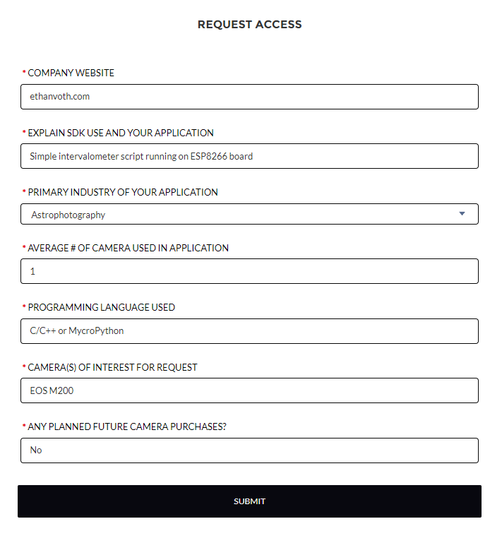
6. You may need to wait for the form to process and refresh the page.
7. Navigate back to the `CCAPI ACTIVATION TOOL` tab.
8. Download the right version for your operating system (unfortunately there doesn't seem to be a Linux version).
9. Download the `CCAPI Getting Started/Operations` PDF for detailed instructions on using the tool.
   - In short: extract the ZIP, plug in your camera, power it on, launch the tool, hit the button, and confirm the following dialogs.

### Building and uploading to ESP8266

This project uses [PlatformIO](https://platformio.org/) for dependency management, building, and uploading. To build this project, install PlatformIO in your IDE of choice, then open the `intervalometer` folder (which is a PlatformIO project folder) in a clone of this repo. Assuming you have a compatible board and it's connected properly, all you should have to do is run the upload command in PlatformIO.

The project was developed and tested using a generic WeMos D1 mini clone, but any ESP8266 dev board that supports the Arduino core should work fine.

## Usage

By default, the ESP will create a Wi-Fi network with the SSID `ESP8266_AP` and the password `defgecd7` while powered. These are configurable in `intervalometer/src/server.cpp`. The board's IP address is `192.168.4.1`.

### Connect phone or computer

1. Connect to the Wi-Fi network (SSID is `ESP8266_AP` and password is `defgecd7` by default). You device may warn you that there's no internet connection and ask if it should stay connected; if so just affirm the connection.
2. In the address bar of a browser, type `192.168.4.1`. You should see the ESP8266 Intervalometer interface.

### Connect camera

_Note: These instructions are written for the Canon EOS M200, but other camera models may be different._

1. Navigate to the Wi-Fi settings screen. You should see an option called `Canon Control API` (click below to see what it looks like on my camera).
   > {}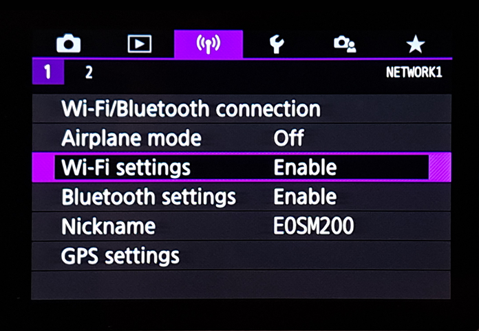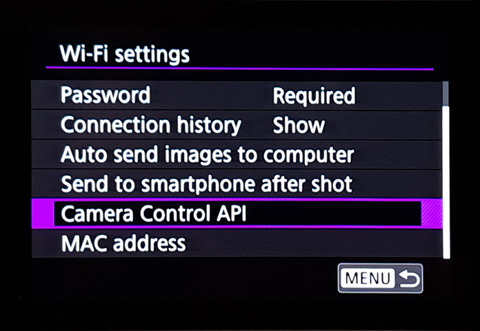{}
   - If you don't see the `Canon Control API` option, make sure your camera is [compatible](https://developers.canon-europe.com/s/article/Latest-CCAPI) and you have followed the [CCAPI activation](#ccapi-activation) instructions above.
2. Select `Camera Control API`, select `Add connection`, then select `Add with wizard`.
3. If the ESP is powered, its network SSID (`ESP8266_AP` by default) should show up on the list. Select it, and then enter and confirm the password (`defgecd7` by default).
   > {}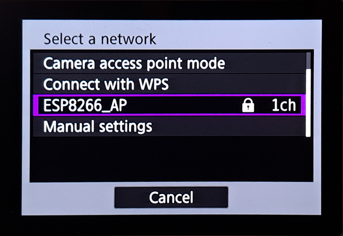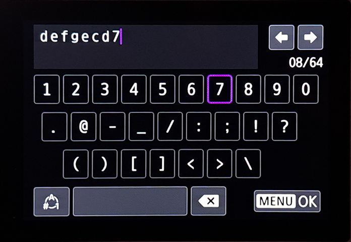{}
4. On the next screen, choose either automatic or manual IP. Setting a manual IP address is recommended so that it always stays the same. Specifically, `192.168.4.7` is the most convenient, since that value is the default value that is pre-populated on the website.
   > {}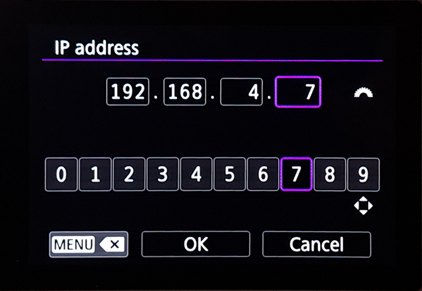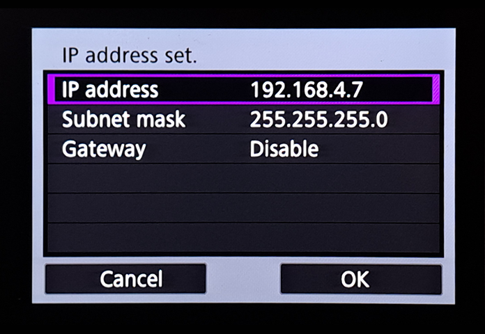{}
5. If all goes well, you should see a screen that says `Waiting to connect`, with the URL of the CCAPI endpoint.
6. Locate the `Connect camera` section of the ESP8266 Intervalometer interface on your other connected device (see [above](#connect-phone-or-computer)). Enter the IP address shown on the camera. For example, if the camera shows `http://192.168.4.7:8080/ccapi`, only enter `192.168.4.7`. Then, press the `Connect` button.
7. The camera should briefly show a screen that says `Settings complete`, then give the option to disconnect, which means the connection has been saved.
8. In the future, you can connect to the network by selecting `Connect` in the main `Camera Control API` screen and selecting the network name.

### Using the intervalometer

Once the camera has been connected for the first time, the intervalometer setup is as follows:

1. Make sure the ESP is powered. Then, connect your phone/computer and camera to the network.
2. Connect the ESP to the camera using the `Connect camera` section of the interface. If successful, the `Intervalometer` section should appear.
3. Use the intervalometer section to start and stop sequences. You can check on the status of the current sequence using the `Status` section at the top.
   - The interval must be long enough so that the camera has time to save each image before taking the next. If using the bulb exposure mode (which allows for custom long exposures of over 30 seconds), the interval should be around 10 seconds longer than the bulb time, although this may vary from camera to camera.

## To-do

- Better error handling (count number, notify user, etc.)
- Ability to set duration (either time or number of shots)
- Ability to add delay (time or amount of time)
- Ability to connect multiple cameras?
- Fix bug where intervalSec is overridden when disabling/enabling bulb mode
- Other features like LCD off, more status info, etc.
- Figure out how to enable async mode in the WebSockets library without having to fork a separate version just to move 3 characters