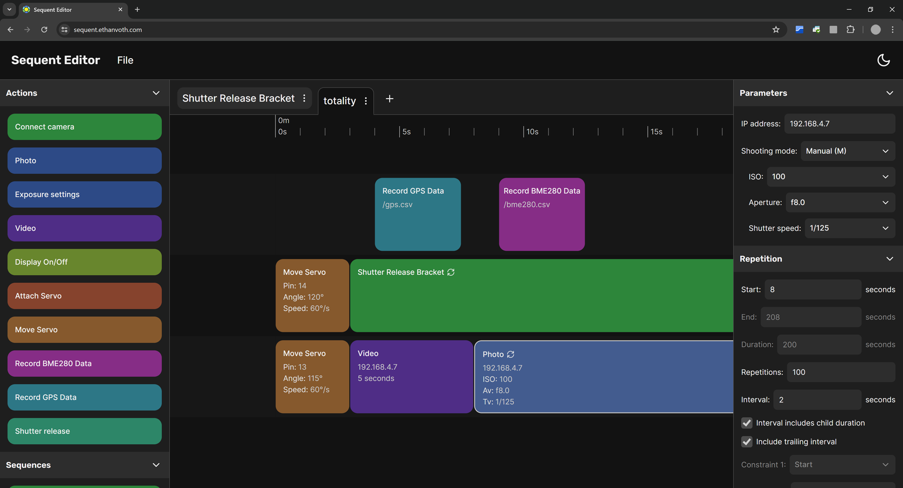
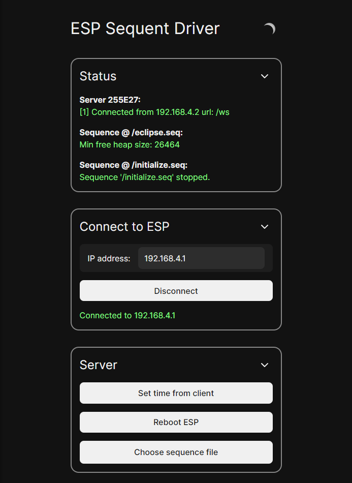
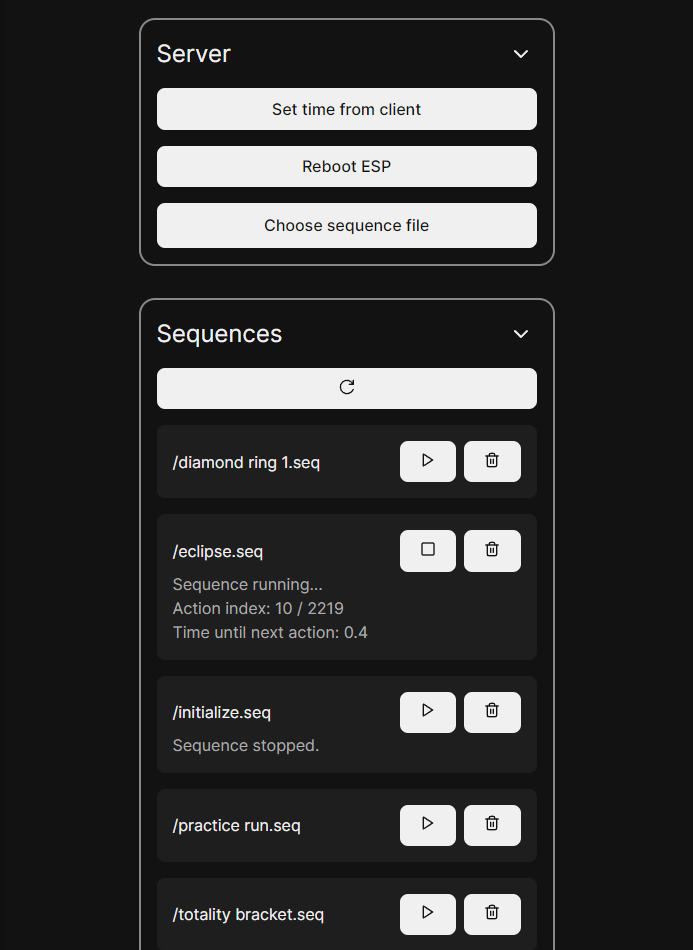
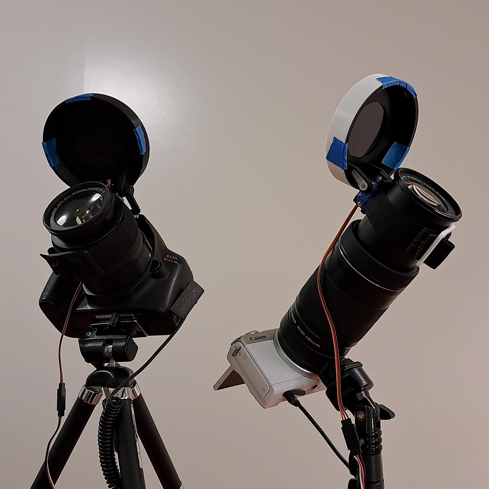

# Sequent

A flexible tool for composing and programmatically executing complex sequences of actions, including time-lapses, sensor readings, and more!

## What is Sequent?

Sequent is a flexible automation system for designing and executing arbitrarily complex sequences of actions. These actions can range from triggering a camera shutter, to recording sensor readings, to moving a servo motor, to anything and everything that can be controlled by some sort of computer.

Currently, Sequent is in early development and only supports specific hardware (the same hardware I used to photograph the 4/8/24 total solar eclipse). In the future, I hope to generalize it to a wide variety of use cases.

The Sequent system consists of 3 parts:
- The [sequence editor](#sequence-editor)
- The [driver program](#driver-program)
- The [hardware](#hardware) (cameras, sensors, etc.)

### Sequence editor

The [Sequent web editor](https://sequent.ethanvoth.com) allows you to create sequences of actions by dragging and dropping them onto the timeline, where you can adjust their timing, place them onto separate layers, and edit their parameters. You can even drag other sequences onto the timeline to reuse or repeat a given sequence of actions.

When you're done creating a sequence, you can export it to your computer. This sequence file is what will be executed by the driver program, which is what connects to and controls the hardware.

### Driver program





The driver program is what reads the sequence file from the web editor and executes it. The device that runs the driver program can be separate from the one that is used to design the sequence editor.

In the case of the ESP32 driver (currently the only driver as a proof-of-concept), the ESP32 connects to various cameras, sensors, and even servo motors. The sequences are uploaded and controlled via a web interface which communicates with the C++ backend. Once a sequence is running, the web interface can be used to monitor the status of the sequence and connected devices, but the connection is not necessary to keep the sequence running since the ESP32 is doing all of the work.

### Hardware





The hardware is what is ultimately being automated. Since the impetus for this project was a system to automate my cameras for the eclipse, the system supports many eclipse-related functions. Below I've listed the hardware components and how they are controlled/utilized by the ESP32.

**Physically connected components:**
- **TF/miroSD card reader:** Used to store and read sequence files, log status/error messages, and record sensor data
- **NEO6MV2 GPS module:** Source of time to ensure accurate timing of actions around and during totality
- **2 x SG90 servo motors:** Integrated into my custom-designed, 3D printed [motorized solar filters](https://github.com/evoth/motorized-solar-filter), which removed the protective solar film during totality
- **BME280 module:** Used to record temperature/humidity/pressure during the eclipse for fun (it did observe a decrease in temperature during the eclipse!)
- **Optocoupler circuit:** Controls the shutter release cable to manually control the shutter of a DSLR

**Wirelessly connected devices:**
- **Canon EOS M200 via CCAPI:** Full control of settings and shutter over WiFi in order to take a time-lapse of the partial phases and perform extreme exposure bracketing during totality
- **Canon EOS Rebel T6 via PTP/IP:** Control of settings and shutter over WiFi using raw PTP packets over IP (this functionality was ultimately unused due to my second ESP32 dying)

**Control devices:**
- Any device with WiFi and a browser can control the ESP32 over the web interface

## How can I use it?

Right now, this project is still in the development stage, so it may be difficult to get the system up and running without having my same hardware. At the very least, you will need an ESP32 board with an SD card reader connected via SPI. Then, you can build and run the PlatformIO project in the `driver_esp/driver` folder.

## Future plans

The system is built to be as flexible as possible, so that it can be generalized to a wide variety of use cases. Driver programs can be written for any device that can parse a JSON file (which is the format of the exported sequence files), which can then control just about anything! However, I suspect this system is most useful for controlling cameras, whether it's taking long-term time-lapses, performing exposure bracketing on a camera that doesn't support it (like I did during the 4/8/24 eclipse), or taking sub-exposures and calibration frames for astrophotography.

I plan on improving the user interface and possibly developing generalized photography-focused driver programs for a variety of platforms. Additionally, because this system worked so well for the April 8th eclipse, I may develop eclipse-specific features in anticipation of upcoming total solar eclipses.
