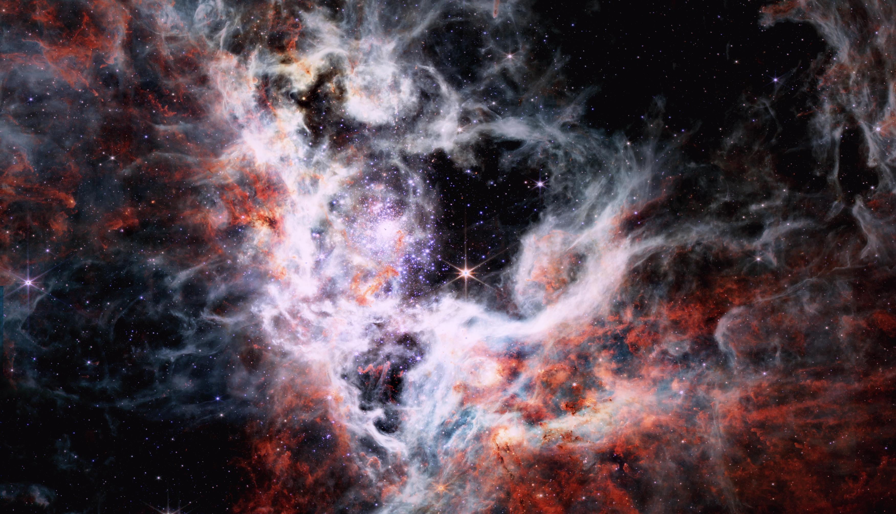

Check back soon for more detailed insight on this project's inspiration, process, and lessons! For now, here's selected content from the [GitHub repo](https://github.com/evoth/webbster):

## Introduction

Every image you've seen is fake. Of course, when you take a picture, it represents a real object, but it does not look exactly as it would if you were there, looking at it yourself.

This is because cameras capture raw data, and it is the way that they synthesize this data into an image that determines how it will look. In the case of space telescopes, they capture images of objects that would be impossible to see with human eyes, whether it be light that is too dim or of an invisible wavelength.

So, our goal when processing these images is not necessarily realism, but more artistic considerations such as clarity, contrast, and beauty. Hopefully, this program can give you a starting point to realize your own artistic vision of space.

## Example images





## How it works

### Background

The [James Webb Space Telescope (JWST)](https://en.wikipedia.org/wiki/James_Webb_Space_Telescope) is an infrared space telescope developed mainly by [NASA](https://en.wikipedia.org/wiki/NASA) in partnership with [ESA](https://en.wikipedia.org/wiki/European_Space_Agency) and [CSA](https://en.wikipedia.org/wiki/Canadian_Space_Agency), and is operated by the [Space Telescope Science Institute (STScI)](https://en.wikipedia.org/wiki/Space_Telescope_Science_Institute). Its near- and mid-infrared imagery capabilities, along with its high resolution and sensitivity, mean that it is able to capture objects dimmer, farther away, and older than any previous space telescope.

The imagery captured by the JWST is used in a variety of astronomical research, and, luckily for us, much of it is available online through the [STScI MAST Portal](https://mast.stsci.edu/portal/Mashup/Clients/Mast/Portal.html). The [JWST Science Calibration Pipeline](https://jwst-docs.stsci.edu/jwst-science-calibration-pipeline-overview) produces a wide variety of data products, but most relevant to our use case are the level 3 (calibrated) 2D image products, which contain the combined, resampled, and calibrated result of each group of exposures; in other words, something resembling a complete image.

However, there's a problem: we can't simply download it to our computer and expect to be able to view it like any other image. This is because the images, instead of being in a common format like `.jpg` or `.png`, come packaged in a file format often used for astronomy called [FITS](https://en.wikipedia.org/wiki/FITS), which has a `.fits` extension.

There are two issues with the image data contained in these FITS files. The first is that it has a [bit depth](https://en.wikipedia.org/wiki/Color_depth), or [dynamic range](https://en.wikipedia.org/wiki/Dynamic_range), that far exceeds that of the screens we use to view media. In other words, each image captured by the JWST, from the pitch black void of space to the centers of galaxies, contains such a wide range of brightness information that it simply can't all be accurately displayed at one time. To deal with this, we have to find a way to crush all of that information into a normal image, while preserving and emphasizing the most interesting details present in the original.

The second issue is that instead of capturing a single color image, the JWST often captures multiple, slightly unaligned grayscale images that each represent a certain band of wavelengths. Meaning that to get the single color image that we want, we end up having to assign each "layer" a somewhat arbitrary color before aligning and overlaying them on top of each other to produce a [false-color](https://en.wikipedia.org/wiki/False_color) image. This creates the illusion of a color image from what was originally taken using infrared light. Although this is not technically "true" color, it can still portray the contrast and differences in intensity between the different wavelength bands, while also looking cool.

So, to recap, the JWST is a telescope in space that takes "images" of various objects in infrared light. And although this data can be found online, there are multiple challenges that must be overcome in order to turn these FITS images into a single color image. Here's how this program attempts to do just that:

### Normalization

As mentioned above, the raw data found in the FITS files that we download has a dynamic range that is much larger than a typical viewable image. Specifically, each pixel can hold 16 bits of information (65536 possible values), whereas your average JPG or PNG only has 8 bits (256 possible values) per color channel for each pixel. In order to convert these 16 bits of brightness data to only 8 bits, it's not enough to just scale down the raw values to fit into the new range; this would result in a mostly dark image with a few specks of light. Instead, we have to artificially enhance, or "stretch", the portion of the original range that contains the majority of the detail.

The first step is "contrast stretching", also known as [normalization](<https://en.wikipedia.org/wiki/Normalization_(image_processing)>). Essentially, we clip off the portions of the brightness range that we don't need (background noise, centers of stars, etc.) and "stretch" the portion of the range that holds the details that we care about (nebulae, gases, dust clouds, etc.). Although this method does sacrifice some information in the darkest and brightest parts of the image, it's worth it to bring out detail that would otherwise be invisible (although I do hope to find a better method in the future). As of now, the bottom 15% and top 0.15% of values are clipped and the remaining 84.85% of the range is rescaled to 100%.

The second step is [adaptive histogram equalization](https://en.wikipedia.org/wiki/Adaptive_histogram_equalization). Although the specifics are complicated, [histogram equalization](https://en.wikipedia.org/wiki/Histogram_equalization) aims to redistribute brightness values in an image such that there is an equal frequency of each brightness value, effectively flattening the histogram. _Adaptive_ histogram equalization goes one step further by equalizing the histogram locally within the image instead of only globally. Again, this is very bad for the "truthfulness" of the image data, but greatly improves the contrast of the resulting image, making it possible to view a huge dynamic range within a single image.

### Alignment

After the contrast of the image has been adjusted to taste, there's another pesky issue keeping us from combining the images: they aren't aligned. Though each individual FITS image is often the result of many different exposures stitched together, these "layers" that represent different wavelength bands are not aligned with each other. So, we have to find a way to do it ourselves.

Figuring out the appropriate transformations needed to align the images with each other simply by analyzing their content for control points (or other similar methods) may as well be impossible. For one, some of the larger images from the JWST clock in at upwards of 100 megapixels, which would make this process extremely expensive. But also, there might not be suitable overlap between the features of the different layers, especially since the structures that are visible often vary by wavelength. In short, we need another way: something that can tell us what transformations we need without any additional analysis on our part.

Fortunately, each FITS file contains a [header](https://docs.astropy.org/en/stable/io/fits/usage/headers.html) that stores a multitude of relevant metadata, including [World Coordinate System (WCS)](https://docs.astropy.org/en/stable/wcs/index.html) data for the image. WCS is used to describe the geometric transformation between two sets of coordinate systems, in this case between the image and [celestial coordinates](https://en.wikipedia.org/wiki/Astronomical_coordinate_systems). This means that each image can be related to an absolute reference frame, and thus we can calculate how to project one image directly onto another, which is exactly what we need.

To make things even easier, there's a lovely package called [reproject](https://reproject.readthedocs.io/en/stable/) that does all the fancy calculations for us; all we need to do is give it an image to transform and the reference image onto which it should be projected, and it gives us our aligned image. However, it turns out that the reprojection process is very computationally expensive, especially in terms of memory. So, to save on memory, the program splits the image into slices (each with a maximum area of 50 million pixels by default), reprojects one slice at a time, and then pieces them together to create the final image.

In the end, each image is aligned to a single reference image, which as of now is the image that starts with the largest area in pixels.

### Colorization

_Note: If the user specifies custom colors by using [`combine-layers.py`](#combine-layerspy), those will be used instead of being automatically selected._

Now, we finally have a collection of aligned grayscale images, so it's time to add some color. Unfortunately, since our program doesn't have a human eye to make decisions based on aesthetics, we have to implement a method to choose reasonable colors for each layer based purely on its metadata instead.

An obvious choice is to color each layer based on the wavelength that it represents. Even though most of what the JWST captures is invisible to the human eye because it's infrared light, we can use redder colors to represent longer wavelengths and bluer colors to represent shorter wavelengths, roughly shifting the range of the JWST into the visible spectrum. The result is a [false-color](https://en.wikipedia.org/wiki/False_color) image that illustrates the structure, nuance, and spectra of an astronomical object in a way that is clear and pleasing to the human eye.

To find the approximate wavelength represented by a certain layer, we can find the name of the [filter](https://jwst-docs.stsci.edu/jwst-near-infrared-camera/nircam-instrumentation/nircam-filters) that was used when capturing it and refer to its [pivot (effective) wavelength](https://www.astro.ljmu.ac.uk/~ikb/research/mags-fluxes/), which can be thought of as the center of its [bandpass](https://en.wikipedia.org/wiki/Band-pass_filter), or range of transmitted wavelengths. We can then find where this wavelength falls on the entire range of the instrument, remapping it inversely (because longer wavelengths are redder and thus have a lower hue) to the range of hues between, say, 0 and 240.

In practice, however, this often results in an image that is a bit too green because many of the filters reside near the middle part of their respective instruments' range. So, in my implementation I have curved the hues toward the edges of the range according to what looked best from my experimentation with a few NIRCAM images. The result is never perfect, but then again, processing these images is an art as much as it is a science, and the automatically selected colors are only meant as a starting point so that we can further refine them by specifying our own.

A similar relationship to the above can be drawn between [bandwidth](<https://en.wikipedia.org/wiki/Bandwidth_(signal_processing)>) and saturation, because light that contains a wider range of wavelengths will generally be less saturated, so the program chooses the saturation of a layer based on the bandwidth of its filter.

Once we have the desired hue and saturation values for our layer, we can colorize the grayscale data by constructing a multiplier which, when applied to three copies of the data, will yield red, green, and blue channels that represent a monochrome image in the appropriate color. During this process, each channel is also compressed into 8 bits.

Now, every layer should be colorized and optionally exported as a JPG or PNG.

### Blending

Last but not least, we need to blend the colorized layers into one RGB image. To do this, I implemented a quick-and-dirty [screen blend](https://en.wikipedia.org/wiki/Blend_modes#Screen), which additively combines the layers as if they were all projected onto a single screen. This way, the colors blend smoothly and the darker regions of each layer allow the brighter features of other layers to shine through.

Additionally, each layer is dimmed by an amount proportional to the total number of layers in order to avoid exaggerated highlights.

And that's it: the resulting image is a color representation of a slice of the universe as seen by the JWST, ready to be viewed and enjoyed in any way you wish! All [publicly available JWST images](https://webbtelescope.org/copyright), as [materials released by NASA](https://www.nasa.gov/multimedia/guidelines/index.html), are part of the public domain (but NASA requests acknowledgment as the source of material).

## Future Plans

My ultimate goal for this project would be a totally self contained GUI app to download, process, and edit these images. I have already done some work on this, but it will probably not be done for a while.

Additionally, I would like to support other space telescopes and release these utilities as a Python package.